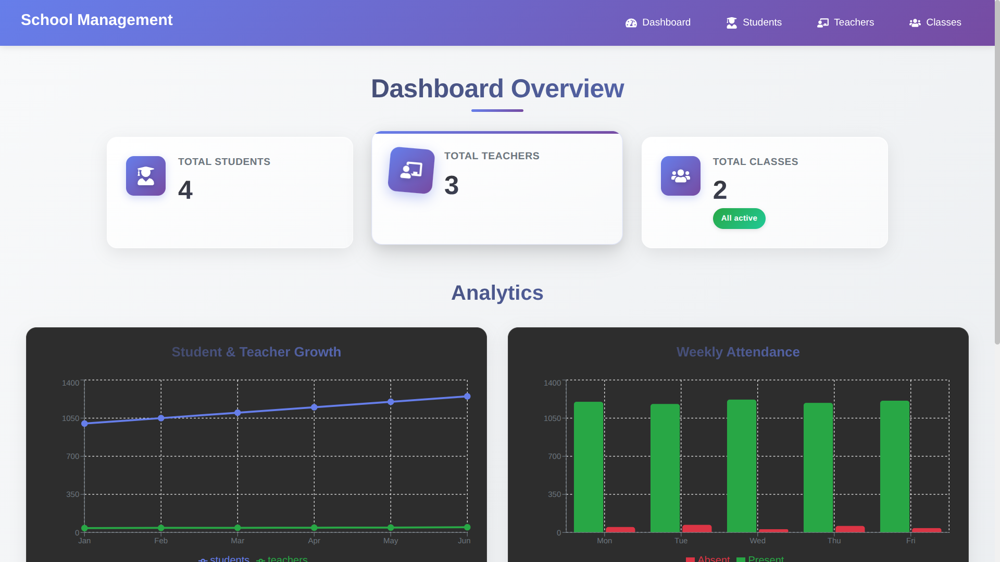

# 🏫 School Management System

A complete school management platform designed to handle the core operations of an educational institute. The project focuses on real-world CRUD workflows, authentication, and relational data handling with a clean full-stack architecture.


## ✨ Features

- 🎓 **Student Management** - Complete CRUD operations for students
- 👨‍🏫 **Teacher Management** - Manage teachers and their assignments
- 📚 **Class Management** - Organize classes and sections
- 📊 **Dashboard Analytics** - Visual insights with charts and metrics
- 🔐 **Secure Authentication** - JWT-based admin authentication
- 🎨 **Beautiful UI** - Modern, responsive design with smooth animations
- ⚡ **Fast Performance** - Optimized with React and TypeScript

## 🛠 Tech Stack

**Frontend:**


**Backend:**


## Demo




## 🚀 Quick Start

### Prerequisites

- Node.js (v18 or higher)
- PostgreSQL (v15 or higher)
- Caddy server (for production-like setup)

## Installation

Follow these steps to run the project locally

**1. Clone the Repository**

```bash
  git clone https://github.com/abdullah-rust/sms.git
```

**2. Create Environment Variables**

```bash
 DATABASE_URL=postgresql://postgres:<password>@localhost:5432/schooldb
 JWT_SECRET=your_jwt_secret
```

**3. Prepare the Database**

```bash
-- Open psql or your preferred SQL tool
-- Execute all queries from the SQL file
file location backend/database.sql
```

This will generate all tables (students, teachers, classes, teacher_classes, etc.).

**4. Configure Caddy (for secure HttpOnly cookies)**

```bash
localhost {

    # Backend API
    handle_path /api/admin* {
        reverse_proxy localhost:3000
    }

    # Frontend
    handle {
        reverse_proxy localhost:5173
    }
}

```

This routing ensures JWT HttpOnly cookies are handled properly and avoids CORS issues.

Run Caddy:

```bash
caddy run
```

**5. Install Dependencies**

**Backend**

```bash
cd backend
npm install
```

**Frontend**

```bash
cd school
npm install
```

**6. Start the Project**

**Start Backend**

```bash
npm run dev
```

**Start Frontend**

```bash
npm run dev
```

**7. Open the Application**

**Visit:**

```bash
http://localhost
```

Your School Management System should now be running properly.
